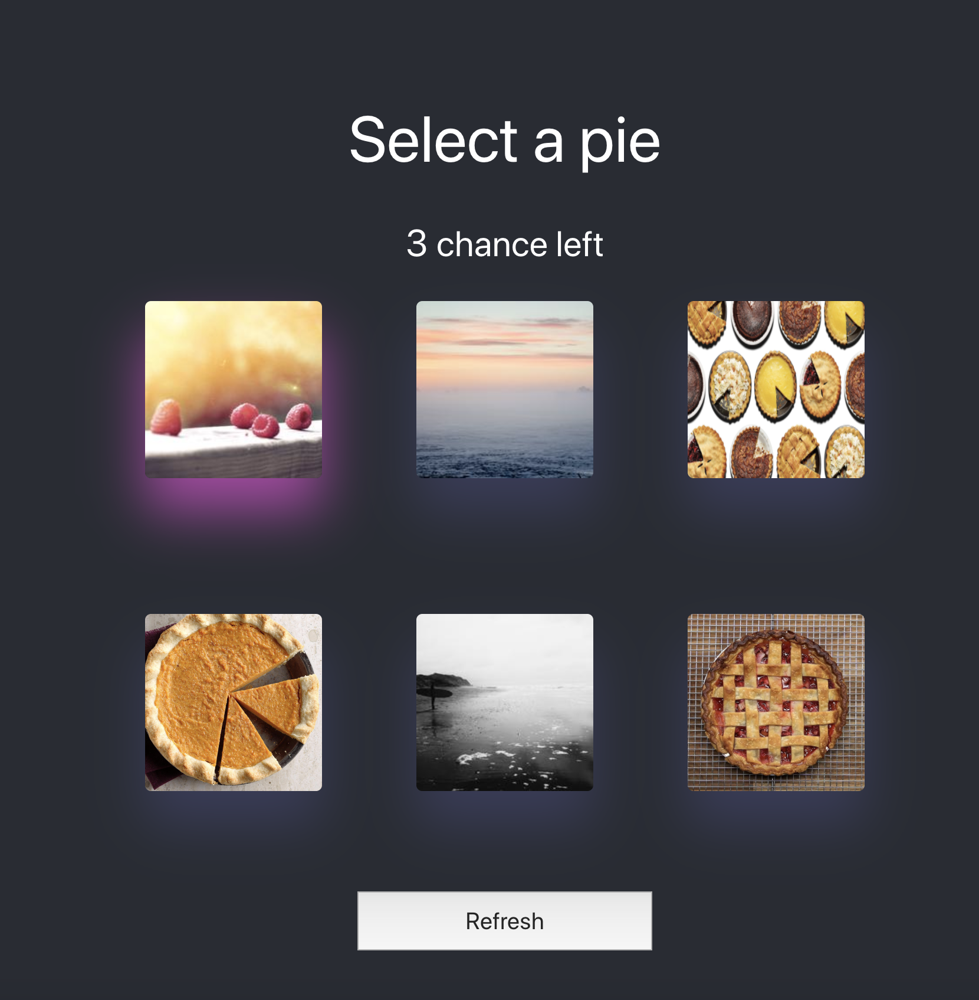

The project is created to demonstrate the following concepts in action.

* async / await
* promises

The outcome of the project is as shown below.



## if you want a quick way to try the code with codesandbox.

* [Import the github repository in codesandbox](https://githubbox.com/sagarjhaa/captcha)


## Or you can pull the project locally to experiment with the code.

* Be in the folder where you want the project to be downloaded
*  ```git clone https://github.com/sagarjhaa/captcha.git```
* ```cd captcha```
* ```npm install``` it will install the dependencies for the project
* ``` npm start ``` it will start local server on port 3000.
* Open [http://localhost:3000](http://localhost:3000) to view it in the browser.


## The working of the project

* If you select the image with pie, it will show success message and refresh the images
* If you select the image which is not a pie, it will reduce the number of chances remaning.
* If you are out of chances, it will refresh the images.
* The **Refresh** button will change the images.